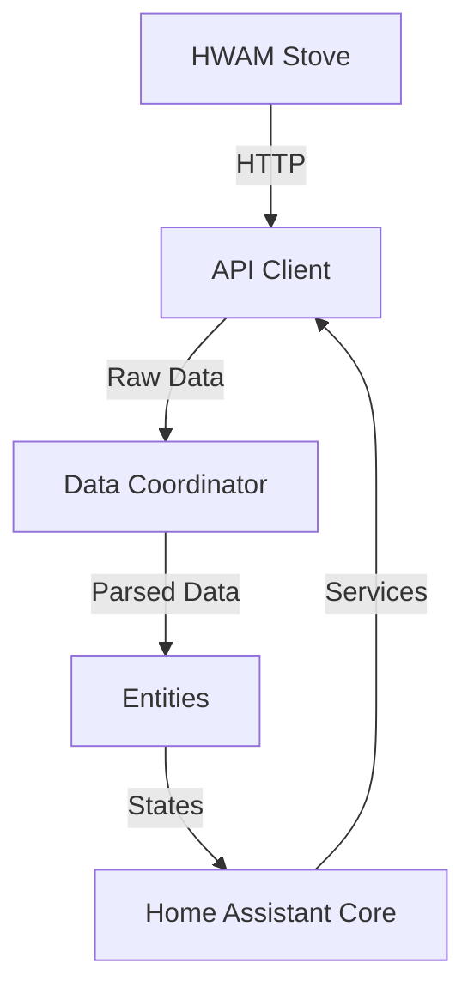

# Documentation Technique HWAM Smart Control

## Architecture de l'intégration

### Structure des fichiers
```
custom_components/hwam_stove/
├── __init__.py          # Point d'entrée de l'intégration
├── manifest.json        # Métadonnées de l'intégration
├── config_flow.py       # Gestion de la configuration
├── const.py            # Constantes
├── coordinator.py      # Coordinateur de données
├── api.py             # Client API HWAM
├── models.py          # Modèles de données
└── entity/           # Entités HA
    ├── __init__.py   # Base des entités
    ├── sensor.py     # Capteurs
    ├── binary_sensor.py  # Capteurs binaires
    ├── number.py    # Contrôles numériques
    └── switch.py    # Interrupteurs
```

### Flux de données


## API HWAM Smart Control

### Points de terminaison disponibles

#### GET /get_stove_data
Retourne l'état actuel du poêle.

**Réponse**:
```json
{
    "stove_temperature": 12000,  // Divisé par 100 pour obtenir °C
    "room_temperature": 2100,    // Divisé par 100 pour obtenir °C
    "oxygen_level": 2000,        // Divisé par 100 pour obtenir %
    "phase": 3,                  // Phase de combustion
    "burn_level": 2,             // Niveau de combustion (0-5)
    "operation_mode": 2,         // Mode de fonctionnement
    "door_open": 0,              // État de la porte (0/1)
    "valve1_position": 50,       // Position valve 1 (%)
    "valve2_position": 60,       // Position valve 2 (%)
    "valve3_position": 70        // Position valve 3 (%)
}
```

#### GET /start
Démarre le processus de combustion.

**Réponse**:
```json
{
    "response": "OK"
}
```

#### POST /set_burn_level
Définit le niveau de combustion.

**Corps de la requête**:
```json
{
    "level": 3  // Valeur entre 0 et 5
}
```

## Modèles de données

### StoveData
Représente l'état complet du poêle avec validation des données.

```python
@dataclass
class StoveData:
    stove_temperature: float    # [0-800°C]
    room_temperature: float     # [-20-50°C]
    oxygen_level: float        # [0-100%]
    phase: int                 # [1-5]
    burn_level: int           # [0-5]
    operation_mode: int       # [0-10]
    door_open: bool
    valve1_position: int      # [0-100]
    valve2_position: int      # [0-100]
    valve3_position: int      # [0-100]
```

## Intervalles et limites

### Mises à jour
- Intervalle minimum : 10 secondes
- Intervalle par défaut : 30 secondes
- Intervalle maximum recommandé : 60 secondes

### Valeurs
- Température maximum poêle : 800°C
- Température d'avertissement : 500°C
- Niveau d'oxygène minimum : 15%
- Historique de température : 24h (288 points)

## Validations

### Température du poêle
```python
@validator('stove_temperature')
def validate_stove_temp(cls, v):
    if v > 600:
        _LOGGER.warning("Température du poêle très élevée: %s°C", v)
    if v > 800:
        raise ValueError("Température hors limites")
    return v
```

### Niveau de combustion
```python
@validator('burn_level')
def validate_burn_level(cls, v):
    if not 0 <= v <= 5:
        raise ValueError("Niveau de combustion invalide")
    return v
```

## Gestion des erreurs

### Types d'erreurs
1. CannotConnect - Erreur de connexion réseau
2. InvalidResponse - Réponse API invalide
3. InvalidAuth - Authentification invalide (si implémentée)

### Exemple de gestion
```python
try:
    data = await api.get_stove_data()
except CannotConnect:
    _LOGGER.error("Impossible de se connecter au poêle")
except InvalidResponse:
    _LOGGER.error("Réponse invalide du poêle")
```

## Format des attributs des entités

### Sensor
```yaml
stove_temperature:
  state: 245.6
  attributes:
    trend: "rising"
    min_24h: 120.3
    max_24h: 350.2
    unit_of_measurement: "°C"
    device_class: "temperature"
```

### Binary Sensor
```yaml
door_open:
  state: "on"
  attributes:
    last_opened: "2024-01-26 14:30:00"
    times_opened_today: 3
    device_class: "door"
```

## Intégration avec Home Assistant

### Services personnalisés
Les services sont enregistrés dans `__init__.py` et définis dans `services.yaml`.

### Configuration
La configuration est gérée via l'interface utilisateur grâce à `config_flow.py`.

## Tests

### Tests unitaires
```bash
pytest tests/test_api.py
pytest tests/test_coordinator.py
pytest tests/test_sensor.py
```

### Tests de couverture
```bash
pytest --cov=custom_components.hwam_stove tests/
```

## Notes de développement

### Meilleures pratiques
1. Toujours utiliser le coordinateur pour les mises à jour
2. Valider toutes les données entrantes
3. Gérer correctement les erreurs de connexion
4. Documenter les changements d'état importants

### Contribution
1. Fork le dépôt
2. Créer une branche pour la fonctionnalité
3. Tests unitaires obligatoires
4. Suivre les conventions de code
5. Créer une pull request
